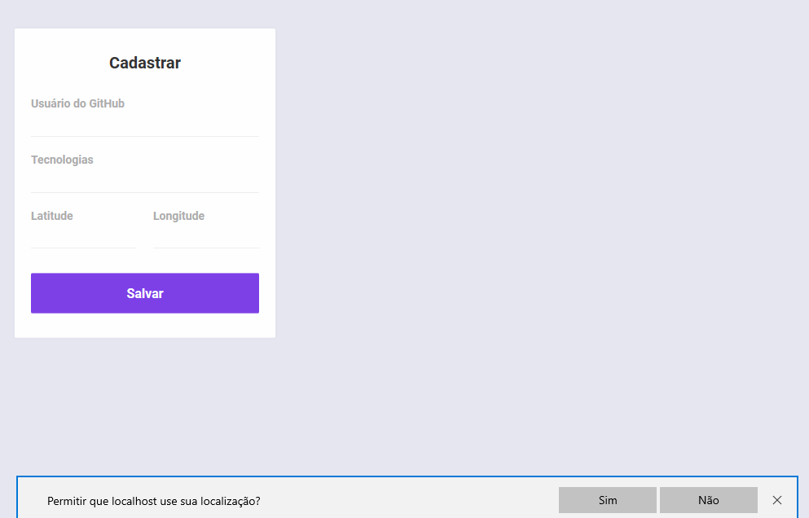

</img>
<h1 align="center">Semana Omnistack 10</h1>

Projeto <strong>DevRadar</strong> Desenvolvido durante a 10ª Edição da Semana Omnistack da Rocketseat

  <a aria-label="Versão do Node" href="https://github.com/nodejs/node/blob/master/doc/changelogs/CHANGELOG_V12.md#12.14.1">
    </img>
</a>
  <a aria-label="Versão do React" href="https://github.com/facebook/react/blob/master/CHANGELOG.md#16120-november-14-2019">
    </img>
  </a>
    <a aria-label="Versão do Expo" href="https://www.npmjs.com/package/expo-cli/v/3.11.5">
    </img>
  </a>
    <a aria-label="Dia 4 de 5" href="https://rocketseat.com.br/week-10/aulas#4">
    </img>
  </a>

  <a aria-label="Desafios" href="DESAFIOS.md">
  	</img>
  </a>
  
  <a aria-label="Repo Size" href="README.md">
  	</img>
  </a>

## :rocket: Tecnologias

### Esse projeto foi desenvolvido com as seguintes tecnologias:

[Node.js](https://nodejs.org/en/)
| [React](https://reactjs.org)
| [React Native](https://facebook.github.io/react-native/)
| [Expo](https://expo.io/)

## 💻 Projeto

### 🛰 DevRadar é um projeto para encontrar desenvolvedores por distância e tecnologias

## :memo: Licença

#### Esse projeto está sob a licença MIT. Veja o arquivo [LICENSE](LICENSE.md) para mais detalhes.

## Frontend

</img>